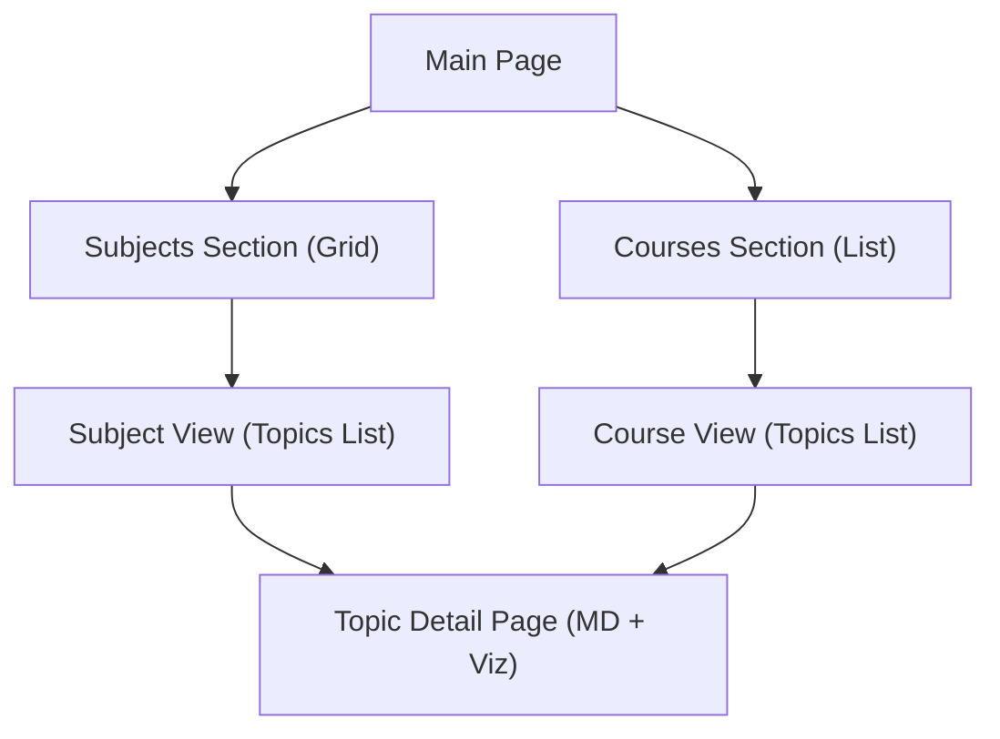

# Project Structure & Tech Stack

This document outlines the architectural organization and the technology choices for the Visualizers application.

## 📁 File Structure

The project follows a modular Django structure, where core logic is separated from specific subject-based visualizations and notes.

```text
Visualizers/
├── manage.py                # Django management script
├── run.py                   # Uvicorn runner script
├── pyproject.toml           # uv project configuration
├── uv.lock                  # uv lockfile
├── requirements.txt         # Exported dependencies
├── .gitignore               # Git ignore file
├── core/                    # Project configuration (settings, urls, asgi, wsgi)
│   ├── settings.py
│   ├── urls.py
│   ├── asgi.py
│   └── wsgi.py
├── apps/                    # Application logic
│   ├── notes/              # Core app managing Subjects, Courses, and Topics
│   │   ├── models.py       # Subject, Course, Topic models
│   │   ├── views.py        # Logic for rendering notes and visualizations
│   │   ├── urls.py         # App-specific routing
│   │   └── forms.py        # Django forms for CRUD operations
│   └── [SubjectName]/      # Directory-based storage for visualizations
│       └── [CourseName]/
│           └── [TopicName]/
│               ├── example.md     # Markdown content with LaTeX & iframes
│               ├── example.html   # Standalone HTML visualization
│               └── static/        # Associated assets for the HTML file
├── web/                     # Global web assets
│   ├── static/              # Global static files (CSS, JS, Images)
│   │   ├── css/
│   │   │   ├── variables.css
│   │   │   ├── styles.css
│   │   │   └── modals.css  # Modal styles
│   │   └── js/
│   │       └── modals.js   # Modal logic
│   └── templates/           # Global HTML templates
│       ├── base.html
│       ├── index.html
│       └── notes/           # App-specific templates
│           ├── subject_detail.html
│           ├── course_detail.html
│           ├── topic_detail.html
│           ├── subject_form.html
│           ├── course_form.html
│           ├── topic_form.html
│           └── delete_confirm.html
└── docs/                    # Documentation and planning files
```

## 🛠️ Tech Stack

### Backend

- **Framework:** [Django](https://www.djangoproject.com/) — High-level Python Web framework.
- **Database:** SQLite (default for development) or PostgreSQL (for production).
- **Core Libraries:**
  - `pathlib`: For managing and looking up folder-based notes.
  - `markdown`: Python implementation of Markdown for parsing content.
  - `pymdown-extensions`:
    - `arithmatex`: For handling MathJax/KaTeX LaTeX delimiters.
    - `superfences`: For advanced code blocks and nested structures.

### Frontend

- **Rendering:**
  - [KaTeX](https://katex.org/): Fast math typesetting for the web.
  - [MathJax](https://www.mathjax.org/): For rendering LaTeX formulas within the converted Markdown.
- **Typography:**
  - `Space Grotesk`: Geometric, modern headers.
  - `DM Sans`: Highly legible body text.
  - `JetBrains Mono`: Data-driven labels and metadata.
- **Design System:** "Vibrant UI" (Glassmorphism, rich gradients, micro-animations).

### Rendering Pipeline

1.  **Entry Point:** User lands on the Main Page featuring "Courses" and "Subjects" sections.
2.  **Navigation:**
    - Selected Course or Subject leads to a List of Topics for that entity.
    - Selected Topic leads to the Detail Page.
3.  **Backend Processing:**
    - Django view locates the `.md` file in the subject directory.
    - Markdown content is converted to HTML using `markdown` and `pymdown-extensions`.
    - LaTeX delimiters are preserved for frontend processing.
4.  **Frontend Rendering:**
    - Base template includes KaTeX/MathJax configuration.
    - MathJax processes "math-protected" tags and renders LaTeX.
    - `<iframe src="...">` embeds associated HTML visualizations via a dedicated static-serving view.

## 🧭 Navigation Flow


